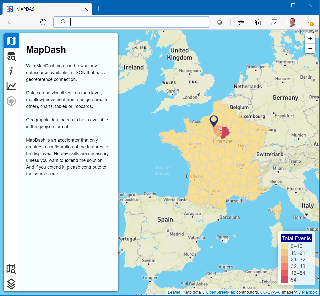
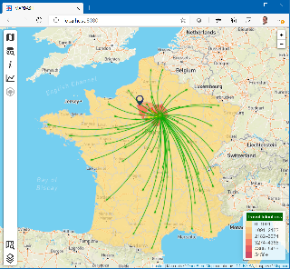
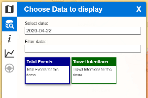
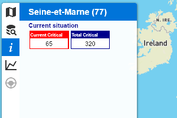
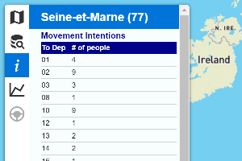
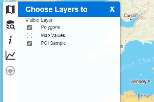

# MapDash
A Map Dashboard for your data
(Under development)



With MapDash you can browse any datasource available in JSON that has a georeference connection.

Data can be visualized in a map layer, mapflow(movement from one geo area to other), charts, tables or infocards.

Geographic data needs to be in available in the geojson format.

MapDash is an accelerator that only requires a configuration of the features to be displayed. No dev skills are necessary unless you want to extend the solution. And if you extend it, please contribute to the source code.



You can see it live with sample data [here](https://mapdash.blob.core.windows.net/mapdash/index.html)

## Features

- All the functionality is configured in the config.js file 
- You can configure:
  - MapSource - Geomap, origin and initial zoom level
  - Data Sources - what data to display - URL and data fields
    - Charts - Charts to be associated with the data source. For each chart there will be a URL associated (can be the same as the data source)
    - Information - What information is displayed everytime a geographic are is selected. Can be mapflow, tables or infocards
  - POILayers - POI to be displayed - hospitals, gas stations, etc
  - Simulations - Ability to call simulations and display the results over the map, mapflow, charts, tables or infocards.

## Customization

The customization is done by changing the config file "config.js"

### MapSource 

The MapSource is defined by:
- title
- geographic boundaries file in geojson format
- center of the map
- initial zoom level
- field name that references the spatial data

Sample, using France public geojson data copied locally with all the Departments where each department is identified by the field "code" :
```javascript
var MAPSOURCE={
    title:"France",
    file:"maps/departments.geojson",
    center:[48.705, 2.5],
    zoom:9,
    codIndex:"code"
}
```

### Data Sources 

Data Sources represent the data that can be explored in the map. They are defined by:
- url - URL of the datasource. Can be local or absolute path
- intervals{} - definition of the color range for the legend. Defined by number of intervals and if the limits are rounded to integer. The interval can be calculated by a division in equal parts between maximum and miniumun (normal) or by dividing the number of existing records in equal intervals(percentile)
- title - Title of the data source
- description - Description of the data source
- areaField - the path to the field that enables the georeference with the mapsource
- field - the path to the field that represents the value to be displayed in the map
- color - background color of the card on the map selection
- infoformat - what is the infoformat id used to display more details (see Information section below)
- graphs[] - list of the id of graphs available for this data source (see Charts section)



```javascript
var dataSources=[
    {
        url:"sampledata/DEPSampleData.json",
        intervals:{
            number:6,
            round:true,
            type:"normal"
        },
        title:"Total Events",
        description:"Total Events for this demo",
        field:"data.current.critical",
        color:"darkblue",
        infoFormat:"daily",
        areaField:"area",
        graphs:["evolution","comparison"]
    },
    ...
]
```

### Charts 

Definition of charts to be displayed:
- id - Chart Id - for internal reference
- title - Title of the chart, displayed to the user
- description - Short description presented to the user
- type - Chart type. Currently implemented: line, bar, scatter
- needSelectedArea - true/false - Chart is presented if there is a selected area geo area.
- data - definition of all parameters to build the chart:
  - url - URL of the data source for the chart
  - x - field path that represents the x axis
  - y[] - field path that represents the y axis, one per series
  - titleX - title for the X axis
  - titleSeries[] - title for each of the series


```javascript
var GraphsDescription=[
    {
        id:"evolution",
        title:"Evolution",
        description:"Graph with evolution this department",
        type:"line",
        needSelectedArea:true,
        data:{
            url:"sampledata/DEPEvolution#AREA#.json",
            x:"date",
            y:["data.current.critical","total.critical"],
            titleX:"",
            titleSeries:["Current","Total"],
        }
    },
```

### Information

When a user selects a geographic region the information is displayed according to this definition.
The information to be presented can be:
Section titles, Infocards, Tables, Mapflow



Section titles

Are just text presented to limit other elements:
```javascript
     {
        format:[
            {
                title:"Movement Intentions",
                type:"section"
            },
            ...
```

Infocards

Represent a box with a title, information associated and a backgroundcolor:

```javascript
            {
                title:"Current Critical",
                field:"data.current.critical",
                color:"red"
            },
```

Tables:

Defined by titles, fields and width for each column:



```javascript
            {
                type:"table",
                fields:["to","people"],
                titles:["To Dep","# of people"],
                width:["50px","auto"]
            },
 ``

Mapflow:

Represent the movement of assets between georegions over the map. Defined by the destination and value to be represented:


```javascript
            {
                type:"mapflow",
                fieldTo:"to",
                fieldValue:"people"
            },
```

A full example can be:

```javascript
var InfoFormats=[
{
        id:"movement",
        format:[
            {
                title:"Movement Intentions",
                type:"section"
            },
            {
                type:"info",
                title:"Current Critical",
                field:"data.current.critical",
                color:"red"
            },
            {
                type:"table",
                fields:["to","people"],
                titles:["To Dep","# of people"],
                width:["50px","auto"]
            },
            {
                type:"mapflow",
                fieldTo:"to",
                fieldValue:"people"
            }
        ]
    },
```

### POILayers - POI to be displayed - hospitals, gas stations, etc

A Point of Interest is represented by the data geojson source. The POI can be initially visible or hidden:




```javacscript
    {
        id:"POISample",
        title:"POI Sample",
        url:"sampledata/POISample.geojson",
        display:true,
        icon:'icon_sample.png',
        nameField:'name'        
    },
```

### Simulations

(in development)

### TOOLS

- [Import GeoJSON](tools/README.MD)

### EXTERNAL LIBRARIES
- [Leaflet](https://leafletjs.com/)
- [Leaflet Sidebar](https://github.com/noerw/leaflet-sidebar-v2)
- [Leaflet MigrationLayer](https://github.com/lit-forest/leaflet.migrationLayer) - Customized
- [Mapbox](https://www.mapbox.com/)
- [Plotly](https://plotly.com/)
- [Iconify](https://iconify.design/)

### Contributors

-

## TODO:
- Language Selection dropdown
- Translation Files